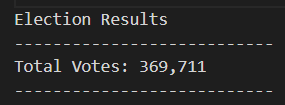
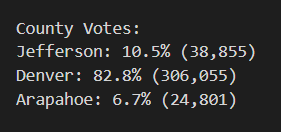
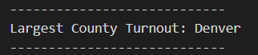
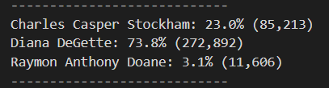
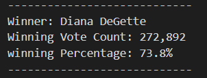

# Election_Analysis

## Overview of Project

We are completing an election audit for the Colorado Board of Elections.

- - -

### Purpose

In this project, our Python script will need to be able to deliver the following information:

*How many votes were cast in this congressional election?

*Provide a breakdown of the number of votes and the percentage of total votes for each county in the precinct.

*Which county had the largest number of votes?

*Provide a breakdown of the number of votes and the percentage of the total votes each candidate received.

*Which candidate won the election, what was their vote count, and what was their percentage of the total votes?

- - -

### Summary

The analysis of the election shows:

*There were 369,711 total votes in the election.

*The counties were:

1) Jefferson
2) Denver
3) Arapahoe

*The counties results were:

Jefferson received 10.5% of the vote and 38,855 number of votes.

Denver received 82.8% of the vote and 306,055 number of votes.

Arapahoe received 6.7% of the vote and 24,801 number of votes.

*The countie with the largest turnout was:

Denver, who received 82.8% of the vote and 306,055 number of votes.

*The candidates were:

1) Charles Casper Stockham
2) Diana DeGette
3) Raymon Anthony Doane

*The candidate results were:

Charles Casper Stockham received 23% of the vote and 85,213 number of votes.

Diana DeGette received 73.8% of the vote and 272,892 number of votes.

Raymon Anthony Doane received 3.1% of the vote and 11,606 number of votes.

*The winner of the election was:

Diana DeGette, who received 73.8% of the vote and 272,892 number of votes.
